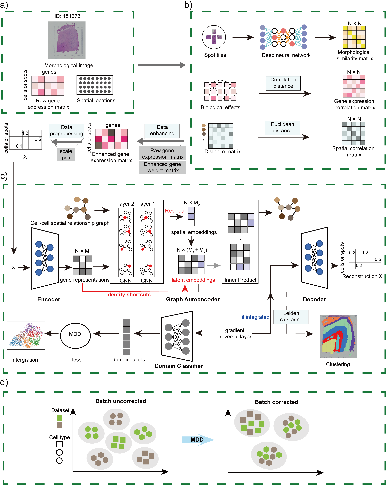

# ResST

## ResST: A graph self-supervised residual learning framework for natural domain identification and data integration of spatial transcriptomics

## Jinjin Huang, Xiaoqian Fu, Zhuangli Zhang, Yinfeng Xie, Shangkun Liu, Yarong Wang, Zhihong Zhao, Youmei Peng*

Spatial transcriptomics (ST) technologies allow for comprehensive characterization of gene expression patterns in the context of tissue microenvironment. However, accurately identifying domains with spatial coherence in both gene expression and histology in situ and effectively integrating data from multi-sample remain challenging. Here, we propose ResST, a graph self-supervised residual learning model based on graph neural network and Margin Disparity Discrepancy (MDD) theory. ResST aggregates gene expression, biological effects, spatial location, and morphological information to capture nonlinear relationships between a cell and surrounding cells for spatial domain identification. Also, ResST integrates multiple ST datasets and aligns latent embeddings based on MDD theory for correcting batch effects. Results show that ResST identifies continuous spatial domains at a finer scale in ten ST datasets acquired with different technologies. Moreover, ResST efficiently integrated data from multiple tissue sections vertically or horizontally while correcting batch effects. Overall, ResST demonstrates exceptional performance in analyzing ST datasets.

## Usage

The ResST is a graph self-supervised residual learning framework for spatial transcriptomics.With ResST, you can:
- Preprocess spatial transcriptomics data from various platforms, such as 10× Visium, seqFISH, MERFISH, 4i, MIBI-TOF, Stereoseq and SlideseqV2.
- Build a deep learning framework with iterative clustering algorithm to identify spatial domains.
- Align the spatial positions of multiple slices, possessing the functionality to handle both vertical and horizontal integration.
## Tutorial

A Jupyter Notebook of the tutorial is accessible from :
[https://github.com/StickTaTa/ResST_main/blob/master/tutorial.ipynb](https://github.com/StickTaTa/ResST_main/blob/master/tutorial.ipynb)
## Requirements

